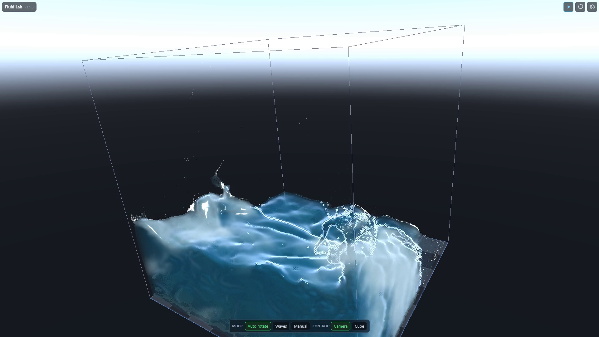

# fluid-lab

A browser-native fluid sim in Rust, WASM, and WebGPU. It is meant to be poked at:
run it, crank the density, switch render modes, and look at what the solver is doing.

[](media/demo/max-density-30s-60fps-128cube.mp4)

[Watch the 30 second demo MP4](media/demo/max-density-30s-60fps-128cube.mp4).

`fluid-lab` runs a bounded-tank FLIP/PIC liquid simulation in the browser. Particles
carry the splash, a MAC grid handles pressure and velocity, and the UI can flip
between water, particle, and grid-slice views. The settings panel is live, and the
profiler reports GPU timing when the browser exposes it.

## Why It Exists

The interesting parts are not hidden behind a nice render pass. WebGPU has no float
atomics, so particle-to-grid accumulation uses fixed-point integer atomics. Pressure
is solved on the GPU with conjugate gradient. The render modes and profiler are there
because this kind of sim is easy to make pretty and hard to make honest.

## Run It

The app lives under `app/`.

```sh
cd app
./local_dev.sh
```

Then open `http://localhost:5184/`.

That script rebuilds the dev WASM package, frees the fixed local port, and serves the
plain JS/HTML shell with no-cache headers. Build and browser-verification details live
in [docs/agent-context/build-run.md](docs/agent-context/build-run.md).

## Working In This Repo

Use the agents for code work. The README is a front door, not the project map.

Fresh agents should start at [docs/index.md](docs/index.md). It routes to the current
architecture docs, build/run workflow, testing notes, and the plan layer. The app code
root is `app/`.
